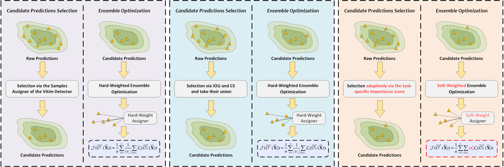

## Task-Specific Importance-Awareness Matters: On Targeted Attacks against Object Detection (IEEE TCSVT'24)

This repo contains the code for our IEEE TCSVT paper "[Task-Specific Importance-Awareness Matters: On Targeted Attacks against Object Detection](https://ieeexplore.ieee.org/document/10589915)" by Xuxiang Sun, Gong Cheng, Hongda Li, Hongyu Peng, and Junwei Han.
> **Abstract:** *Targeted Attacks on Object Detection (TAOD) aim to deceive the victim detector into recognizing a specific instance as the predefined target category while minimizing the changes to the predicted bounding box of that instance. Yet, this kind of flexible attack paradigm, which is capable of manipulating the decision outcome of the victim detector, received limited attention, especially in the context of attacking object detection in optical remote sensing images, where relevant research remains a blank. To fill this gap, this paper concentrates on TAOD in optical remote sensing images, and pays attention to a fundamental question, how to deploy TAOD via the raw predictions (the predictions before non-maximum suppression) of a victim detector. In this regard, we depart from widely adopted task-independent importance measurements and hard-weighted ensemble optimization schemes present in existing methods. Instead, we first define the task-specific importance score, which considers both the qualities and the attack costs of predictions. Further, we propose the Task-Specific Importance-Aware Candidate Predictions Selection Scheme (TSIA-CPSS) alongside the Soft-Weighted Ensemble Optimization Scheme (SW-EOS). A total of eleven detectors on DIOR and DOTA, two commonly employed benchmarks, are included to comprehensively evaluate our approach. Furthermore, we indicate that the effectiveness of our approach is not only substantial for vanilla TAOD, but also can be better generalized to extended scenarios, which encompasses random TAOD, TAOD on oriented object detection, and targeted patch attacks, highlighting the noteworthy potential of our approach.*

<p align="middle">
  
</p>

#### :sparkles: News
**[Jul 6, 2024]**
- "Readme" has been updated.

#### :blue_book: Citation
If you think this repository may be helpful to you, please consider giving a star :star: and citation. Thanks for your consideration.
```
@article{sun2024task,
  title={Task-Specific Importance-Awareness Matters: On Targeted Attacks against Object Detection},
  author={Sun, Xuxiang and Cheng, Gong and Li, Hongda, and Peng, Hongyu, and Han, Junwei},
  booktitle={IEEE Trans. Circuit Syst. Video Technol.},
  pages={1--11},
  year={2024},
  doi={10.1109/TCSVT.2024.3425655}
}
```
#### :page_facing_up: System Environment

* CUDA: CUDA 11.3
* CUDNN: CUDNN 8.2.1
* Linux: Ubuntu 16.04.7
* gcc/g++: 7.3.0
* Pytorch: 1.12.0
* Python: 3.8.17
* Torchvision: 0.13.0

### :bookmark_tabs: Quick Start
#### 1. Datasets
The download link of these datasets can be accessed at [AAOD-ORSI](https://github.com/xuxiangsun/AAOD-ORSI).

#### 2. Getting Started
1. Clone the repo
2. Prepare environment with PyTorch
```
conda create -n tsiaa python=3.8
conda activate tsiaa
conda install pytorch torchvision -c pytorch
```
3. Install MMDetection
```
pip install -U openmim
mim install mmengine
mim install mmcv==2.0.0
cd /path/to/this/repo/
pip install -v -e .
```
4. Run 
attack
```
python tools/attack.py /path/to/config /path/to/checkpoint --name /save/name/ \
--epsilon 16 --steps 20
```
5. Test 
```
python tools/test.py /path/to/config /path/to/checkpoint 
```
## License

This project is released under the [Apache 2.0 license](LICENSE).

